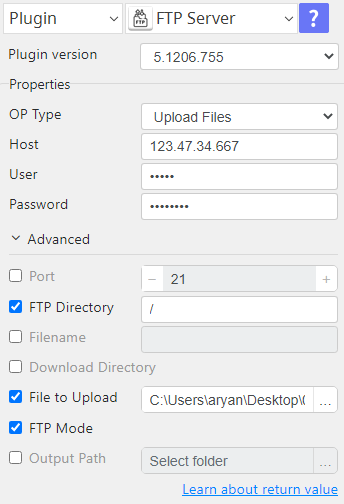
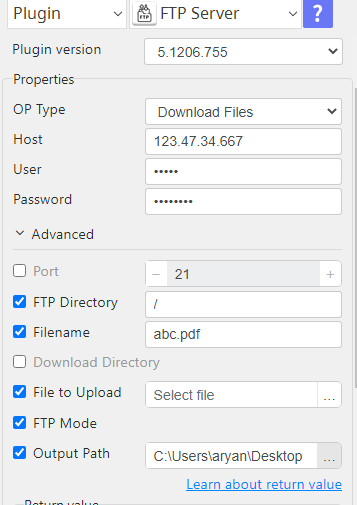
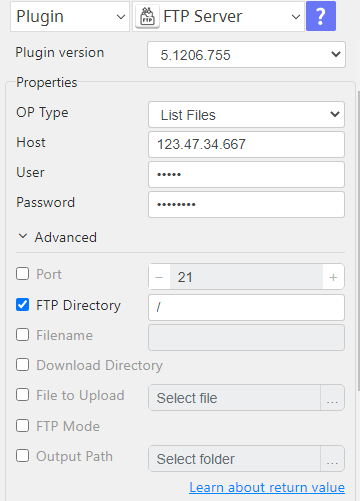

# FTP Server

***This plugin allows upload files to FTP server and download files from FTP server.***

## FTP Server
| Item         |          Value           |
|--------------|:------------------------:|
| Icon         |   |
| Display Name |      **FTP Server**      |

## Arun Kumar (ak080495@gmail.com)

Arun Kumar
* [Email](mailto:ak080495@gmail.com) 
 
## Version Control 
* [5.1206.755](setup.yaml)
* Release Date: `December 06, 2023`

## Input (Required)
| OP Type         | Selection      | Default Value                           |
|-----------------|----------------|-----------------------------------------|
| Upload Files    | Host           | (message success)                       |
|                 | Port           |                                         |
|                 | User           |                                         |
|                 | Password       |                                         |
|                 | FTP Directory  |                                         |
|                 | File to Upload |                                         |
| Download Files  | Host           | (Downloaded file path,message success ) |
|                 | Port           |                                         |
|                 | User           |                                         |
|                 | Password       |                                         |
|                 | FTP Directory  |                                         |
|                 | Filename       |                                         |
|                 | Output Path    |                                         |

### Notes:-
<ul>
    <li>FTP Mode active/passive choose according host.</li>
</ul>

## Return Value

### Normal Case
Description of output result

## Return Code
| Code | Meaning                      |
|------|------------------------------|
| 0    | Success                      |
| 99   | Exceptional case             |

## Output Format
You may choose one of 3 output formats below,

<ul>
  <li>String (default)</li>
  <li>CSV</li>
  <li>File</li>
</ul>  

## Parameter setting examples (diagrams)

## Operations

### Upload Files:

### Download Files:

### List Files:

